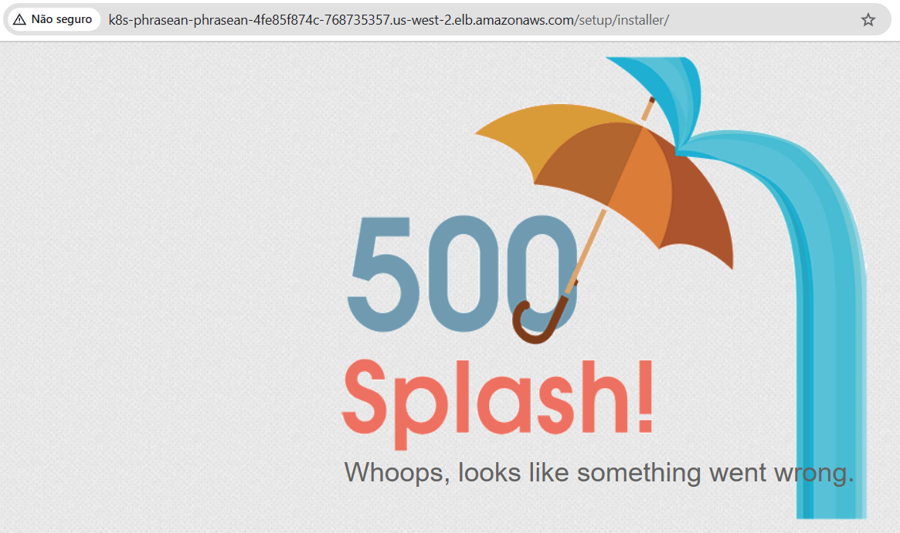

# MAM on EKS

This documentation provides steps to deploy **Phraseanet** using **AWS EKS**.

Phraseanet's official documentation demonstrates deployment using **Docker Compose**. This guide, however, focuses on deploying Phraseanet in a **Kubernetes cluster**, specifically within **AWS EKS**.
### **Note:**
We initially explored deploying Phraseanet on Kubernetes using manually converted manifests. However, we later discovered an official **Helm chart** (designed for Minikube). Although Helm was initially considered a backup plan, it has now become the **primary deployment method** in this repository.
## Overview
In Kubernetes, each service defined in the **Docker Compose** file is translated into one or more **Kubernetes objects**, such as **Pods, Deployments, and Services**.
## Services
The following Phraseanet services have been identified:
- `phraseanet-gateway`
- `phraseanet-db`
- `phraseanet-worker`
- `phraseanet-elasticsearch`
- `phraseanet-fpm`
- `phraseanet-rabbitmq`
- `phraseanet-redis`
- `phraseanet-redis-session`
- `phraseanet-setup`

These services provide **Dockerfiles** to build images locally. They also share images through the DockerHub profile **alchemyfr**:

```bash
https://hub.docker.com/r/alchemyfr/phraseanet-fpm
https://hub.docker.com/r/alchemyfr/phraseanet-worker
https://hub.docker.com/r/alchemyfr/phraseanet-nginx
https://hub.docker.com/repository/docker/alchemyfr/phraseanet-db
https://hub.docker.com/repository/docker/alchemyfr/phraseanet-elasticsearch
```

The `gateway`, `fpm`, and `setup` services are core components of the platform. The **fpm** service is resource-intensive and may require careful scaling.
## Cluster Setup

We are deploying the services on an **EKS (Elastic Kubernetes Service)** cluster within an **AWS account**.  
This `main` branch is focused on deploying the cluster and services for a **production environment**.

Here are some of the key approaches:

- Some open-source components will be replaced with AWS Managed Services:
	- RabbitMQ → Amazon MQ
	- MariaDB → Amazon RDS
    - Redis → Amazon ElastiCache
    - Elasticsearch → Amazon OpenSearch
        
- The core services will run inside EKS pods:
	- `phraseanet-fpm`
    - `phraseanet-gateway`
    - `phraseanet-setup`
    - `phraseanet-create-db` *
    - `phraseanet-cron-reminder` *

The last two services are cronjobs. They run during the deployment process and on a scheduled basis.
### Preparing AWS Resources

As mentioned, this guide assumes a **production environment** with AWS access configured via the AWS CLI profile `prod`.
If you're setting up a sandbox environment, refer to the [sandbox branch README](https://github.com/trackit/mam-on-eks/tree/sandbox).

1. **Create an S3 Bucket for Terraform State:**
The names used are just examples, such as `prod-tf-states`, `mam-on-eks-tf-lock-table`, `Leandro Mota`.  
Change it as desired.  

```bash
aws s3api create-bucket \
  --bucket prod-tf-states \
  --region us-west-2 \
  --create-bucket-configuration LocationConstraint=us-west-2 \
  --profile prod
```
2. **Add Tags to the S3 Bucket:**

```bash
aws s3api put-bucket-tagging \
  --bucket prod-tf-states \
  --tagging 'TagSet=[{Key=Environment,Value=prod},{Key=Owner,Value="Leandro Mota"},{Key=Project,Value=mam-on-eks},{Key=Name,Value=prod-tf-states}]' \
  --profile prod
```
3. **Create a DynamoDB Table for Terraform Locking (Optional):**

```bash
aws dynamodb create-table \
  --table-name mam-on-eks-tf-lock-table \
  --attribute-definitions AttributeName=LockID,AttributeType=S \
  --key-schema AttributeName=LockID,KeyType=HASH \
  --billing-mode PAY_PER_REQUEST \
  --region us-west-2 \
  --profile prod
```
4. **Tag the DynamoDB Table:**

```bash
aws dynamodb tag-resource \
  --resource-arn arn:aws:dynamodb:us-west-2:<YOUR_AWS_ACCOUNT_ID>:table/mam-on-eks-tf-lock-table \
  --tags Key=Name,Value=mam-on-eks-tf-lock-table Key=Environment,Value=prod Key=Owner,Value="Leandro Mota" Key=Project,Value=mam-on-eks \
  --region us-west-2 \
  --profile prod
```
5. **Create a Secret for Terraform Variables in AWS Secrets Manager(Optional):**

```bash
aws secretsmanager create-secret \
  --region "us-west-2" \
  --profile prod \
  --name "mam-on-eks-tfvars" \
  --secret-string file://prod.tfvars \
  --tags '[{"Key":"Name", "Value":"mam-on-eks-tfvars"}, {"Key":"Owner", "Value":"Leandro Mota"}, {"Key":"Project", "Value":"mam-on-eks"}]'
```
### Running Terraform

Before running Terraform, ensure that your AWS CLI profile is correctly configured with the necessary credentials. Additionally, you need a `.tfvars` file containing the required values. A sample file (`sample.tfvars`) is available in the **terraform** folder.
### Initializing Terraform

First, initialize Terraform with the following command:

```bash
terraform init \
  -backend-config="bucket=prod-tf-states" \
  -backend-config="key=terraform-sandbox/mam-on-eks-state" \
  -backend-config="region=us-west-2" \
  -backend-config="dynamodb_table=mam-on-eks-tf-lock-table" \
  -backend-config="dynamodb_endpoint=https://dynamodb.us-west-2.amazonaws.com"
```

If needed, set the AWS profile environment variable:  

```bash
export AWS_PROFILE=prod
```

Then, create a workspace for your environment:

```bash
# Replace <env> with the desired environment name for example: sandbox, dev, prod
terraform workspace new <env>
```

Set the workspace to the desired environment:

```bash
terraform workspace select <env>
```

Finally, run the following commands to deploy the infrastructure:

```bash
terraform plan --out=plan.out -var-file="prod.tfvars"
terraform apply "plan.out"
```
### Configuring kubeconfig for EKS Access

After deploying the cluster, update your `kubeconfig` file to interact with EKS:

```bash
aws eks --region us-west-2 update-kubeconfig \
  --name mam-on-eks \
  --kubeconfig ~/.kube/mam-on-eks-config \
  --profile prod
```
## Helm Chart Setup

This setup is automatically handled by Terraform after it completes the deployment of EKS.

However, if needed, you can manually deploy it using a Helm client along with the kubeconfig file for the cluster.

Below are the steps to follow:
### Steps to Deploy

1. The necessary files are located in the `phraseanet/helm/charts` folder.
2. To install, run :

```bash
helm install phraseanet ./phraseanet -n phraseanet --create-namespace
```

This command creates a Helm release inside the EKS cluster and installs all the necessary Kubernetes manifests for deploying Phraseanet.

## Post Cluster Setup

If everything went ok the Phraseanet platform should be available at AWS ALB DNS.
For example:
``k8s-phrasean-phrasean-4fe85f874c-768735357.us-west-2.elb.amazonaws.com``

To know your exact URL run this ``kubectl`` command:
```bash
kubectl describe $(kubectl get ingress -n phraseanet -o name) -n phraseanet | grep '^Address:' | awk '{print $2}'
```

If the URL shows a 500 error "Whoops, looks like something went wrong " like this one below is because the FPM needs a restart because the phraseanet-setup didn't restart it after the configuration the setup did.



So, just restart the FPM deployment with the command below:
```bash
kubectl rollout restart deployment phraseanet-fpm -n phraseanet
```

The Phraseanet platform working looks like the images below.


## Cluster Setup Possible errors

### Kubernetes Manifests stuck

Right after the installation of the EKS addons by terraform some errors can happen.  
It's due the current kubectl provider for terraform. For unknown reason it's not able to get the EKS credentials at the start.  
It's probably because the EKS Auto Mode not necessarily makes the compute resource available right at the beginning.  

If that happens, just run the `terraform plan` and `terraform apply` commands again.  

Some of the mentioned errors:
```bash
Error: standard failed to create kubernetes rest client for update of resource: the server has asked for the client to provide credentials
│
│   with kubectl_manifest.standard_sc,
│   on k8s-manifests.tf line 16, in resource "kubectl_manifest" "standard_sc":
│   16: resource "kubectl_manifest" "standard_sc" {
│
╵
```

```bash
│ Error: kube-system/aws-load-balancer-controller failed to create kubernetes rest client for update of resource: the server has asked for the client to provide credentials
│
│   with kubectl_manifest.aws_lb_controller_sa,
│   on k8s-manifests.tf line 54, in resource "kubectl_manifest" "aws_lb_controller_sa":
│   54: resource "kubectl_manifest" "aws_lb_controller_sa" {
│
╵
```