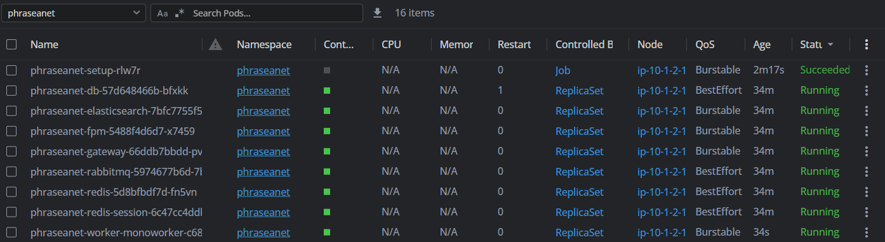
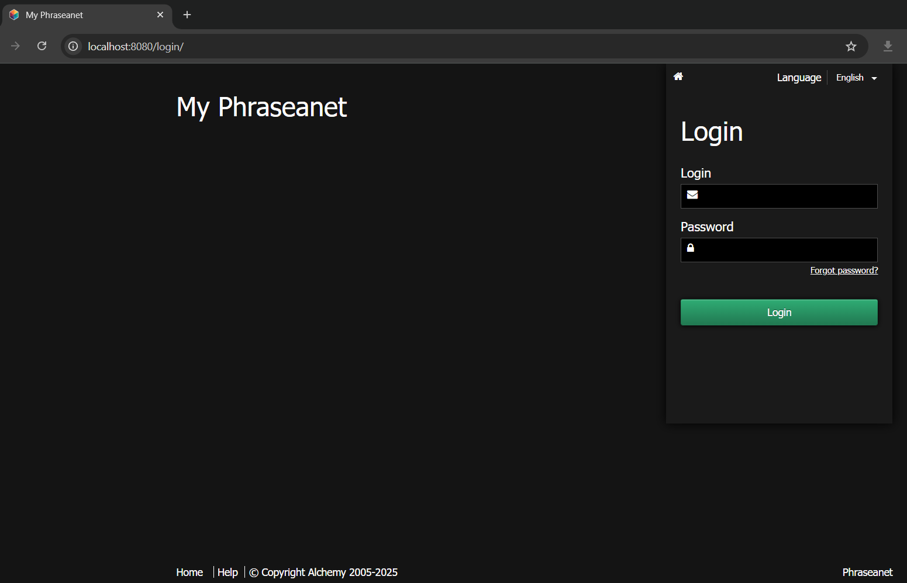
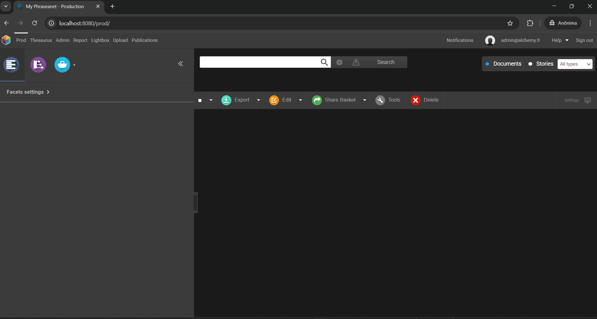
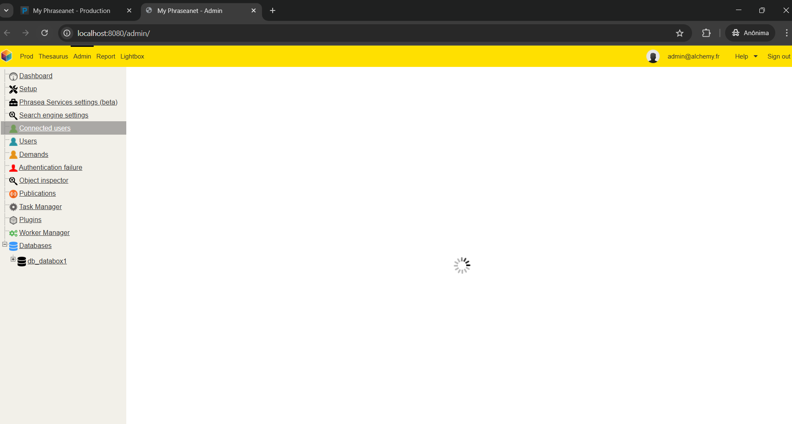
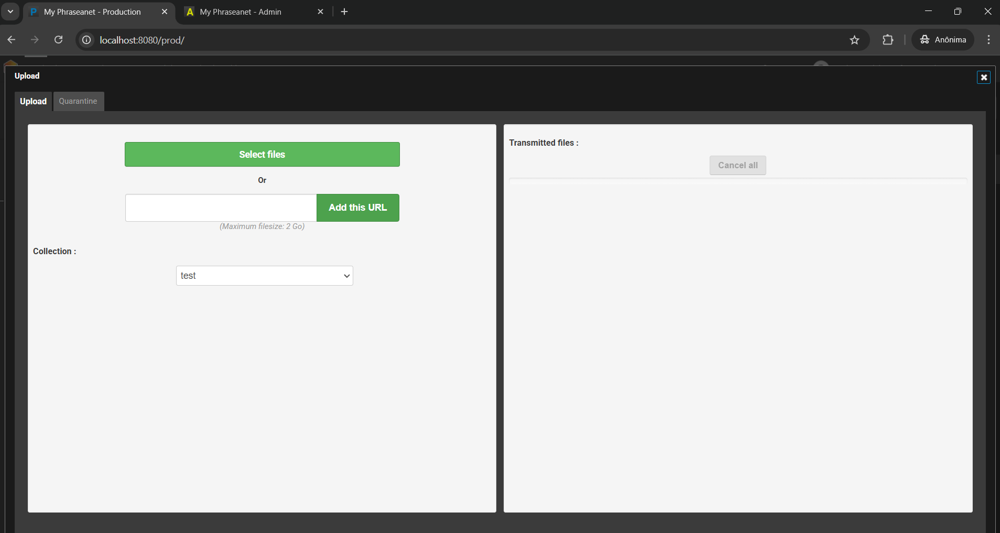

# MAM on EKS

This documentation provides steps to deploy **Phraseanet** using **Kubernetes** instead of **Docker Compose**.

Phraseanet's official documentation demonstrates deployment using **Docker Compose**. This guide, however, focuses on deploying Phraseanet in a **Kubernetes cluster**, specifically within **AWS EKS**.

### **Note:**

We initially explored deploying Phraseanet on Kubernetes using manually converted manifests. However, we later discovered an official **Helm chart** (designed for Minikube). Although Helm was initially considered a backup plan, it has now become the **primary deployment method** in this repository.

## Overview

In Kubernetes, each service defined in the **Docker Compose** file is translated into one or more **Kubernetes objects**, such as **Pods, Deployments, and Services**.

## Services

The following Phraseanet services have been identified:

- `phraseanet-gateway`
- `phraseanet-db`
- `phraseanet-worker`
- `phraseanet-elasticsearch`
- `phraseanet-fpm`
- `phraseanet-rabbitmq`
- `phraseanet-redis`
- `phraseanet-redis-session`
- `phraseanet-setup`

These services provide **Dockerfiles** to build images locally. They also share images through the DockerHub profile **alchemyfr**:

```bash
https://hub.docker.com/r/alchemyfr/phraseanet-fpm
https://hub.docker.com/r/alchemyfr/phraseanet-worker
https://hub.docker.com/r/alchemyfr/phraseanet-nginx
https://hub.docker.com/repository/docker/alchemyfr/phraseanet-db
https://hub.docker.com/repository/docker/alchemyfr/phraseanet-elasticsearch
```

The `gateway`, `fpm`, and `setup` services are core components of the platform. The **fpm** service is resource-intensive and may require careful scaling.

## Cluster Setup

We are deploying the services on an **EKS (Elastic Kubernetes Service)** cluster within an **AWS account** for testing purposes.

### Preparing AWS Resources

This guide assumes a **sandbox environment**, with AWS access configured via the AWS CLI profile `sandbox`.

1. **Create an S3 Bucket for Terraform State:**

The names used are just examples, such as `sandbox-tf-states`, `mam-on-eks-tf-lock-table`, `Leandro Mota`.  
Change it as desired.  

```bash
aws s3api create-bucket \
  --bucket sandbox-tf-states \
  --region us-west-2 \
  --create-bucket-configuration LocationConstraint=us-west-2 \
  --profile sandbox
```

2. **Add Tags to the S3 Bucket:**

```bash
aws s3api put-bucket-tagging \
  --bucket sandbox-tf-states \
  --tagging 'TagSet=[{Key=Environment,Value=sandbox},{Key=Owner,Value="Leandro Mota"},{Key=Project,Value=mam-on-eks},{Key=Name,Value=sandbox-tf-states}]' \
  --profile sandbox
```

1. **Create a DynamoDB Table for Terraform Locking (Optional):**

```bash
aws dynamodb create-table \
  --table-name mam-on-eks-tf-lock-table \
  --attribute-definitions AttributeName=LockID,AttributeType=S \
  --key-schema AttributeName=LockID,KeyType=HASH \
  --billing-mode PAY_PER_REQUEST \
  --region us-west-2 \
  --profile sandbox
```

2. **Tag the DynamoDB Table:**

```bash
aws dynamodb tag-resource \
  --resource-arn arn:aws:dynamodb:us-west-2:<YOUR_AWS_ACCOUNT_ID>:table/mam-on-eks-tf-lock-table \
  --tags Key=Name,Value=mam-on-eks-tf-lock-table Key=Environment,Value=sandbox Key=Owner,Value="Leandro Mota" Key=Project,Value=mam-on-eks \
  --region us-west-2 \
  --profile sandbox
```

3. **Create a Secret for Terraform Variables in AWS Secrets Manager(Optional):**

```bash
aws secretsmanager create-secret \
  --region "us-west-2" \
  --profile sandbox \
  --name "mam-on-eks-tfvars" \
  --secret-string file://sandbox.tfvars \
  --tags '[{"Key":"Name", "Value":"mam-on-eks-tfvars"}, {"Key":"Owner", "Value":"Leandro Mota"}, {"Key":"Project", "Value":"mam-on-eks"}]'
```

### Running Terraform

Before running Terraform, ensure that your AWS CLI profile is correctly configured with the necessary credentials. Additionally, you need a `.tfvars` file containing the required values. A sample file (`sample.tfvars`) is available in the **terraform** folder.

### Initializing Terraform

First, initialize Terraform with the following command:

```bash
terraform init \
  -backend-config="bucket=sandbox-tf-states" \
  -backend-config="key=terraform-sandbox/mam-on-eks-state" \
  -backend-config="region=us-west-2" \
  -backend-config="dynamodb_table=mam-on-eks-tf-lock-table" \
  -backend-config="dynamodb_endpoint=https://dynamodb.us-west-2.amazonaws.com"
```

If needed, set the AWS profile environment variable:  

```bash
export AWS_PROFILE=sandbox
```

Then, create a workspace for your environment:

```bash
# Replace <env> with the desired environment name for example: sandbox, dev, prod
terraform workspace new <env>
```

Then, set the workspace to the desired environment:

```bash
terraform workspace select <env>
```

Finally, run the following commands to deploy the infrastructure:

```bash
terraform plan --out=plan.out -var-file="sandbox.tfvars"
terraform apply "plan.out"
```

### Configuring kubeconfig for EKS Access

After deploying the cluster, update your `kubeconfig` file to interact with EKS:

```bash
aws eks --region us-west-2 update-kubeconfig \
  --name mam-on-eks \
  --kubeconfig ~/.kube/mam-on-eks-config \
  --profile sandbox
```

## Helm Chart Setup

This setup is automatically handled by Terraform after it completes the deployment of EKS.
However, if needed, you can manually deploy it using a Helm client along with the kubeconfig file for the cluster.

Below are the steps to follow:

### Steps to Deploy

1. The necessary files are located in the `phraseanet/helm/charts` folder.
2. To install, run :

```bash
helm install phraseanet ./phraseanet -n phraseanet --create-namespace
```

This command creates a Helm release inside the EKS cluster and installs all the necessary Kubernetes manifests for deploying Phraseanet.

## Phraseanet Post-Installation

### Database operation

After the Phraseanet manifest deploys, the worker pods will not function because they depend on the completion of the `phraseanet-setup` job.
The setup fails because it tries to access a database inside `phraseanet-db` that doesn't exist, despite the instructions indicating that the container image includes the database (which is not the case).
To resolve this, you must remotely connect to the `phraseanet-db` pod and manually create the required databases.

#### Steps:

1. Access the database pod container shell:

```bash
kubectl exec -i -t -n phraseanet <phraseanet-db-pod-name> -c db -- sh -c "clear; (bash || ash || sh)"
```

2. To show the current databases:

```sql
mysql -u root -p -e "SHOW DATABASES;"
```

3. To create the two necessary databases:

```sql
mysql -u root -p -e "CREATE DATABASE ab_master; CREATE DATABASE db_databox1;"
```

The database password can be found in the `myvalues.yaml` file.

If the `phraseanet-setup` job does not finish after creating the databases, it may be necessary to manually restart the job. You can do this by temporarily setting `app.phraseanet_setup` to `0` and then back to `1` in the Helm values.

Once the setup is complete, the pods should be in a running state.



### Accessing Phraseanet Frontend

The Phraseanet frontend is not publicly exposed in this setup. However, you can access it locally using Kubernetes **port forwarding**.

Run:

```bash
kubectl port-forward svc/phraseanet-gateway 8080:80 -n phraseanet
```

Now, access the platform at **[http://localhost:8080](http://localhost:8080/)** in your web browser.

Some screenshots of Phraseanet running on EKS:  








## Next Steps

Currently, this deployment covers only the basic setup. Below are some planned improvements for future implementation:

1. Integrate the Kubernetes manifests into Terraform. 🚧
2. Gain basic knowledge about the Phraseanet services, for example uploading and transcoding. 🚧
3. Implement **Application Load Balancer (ALB)** using Kubernetes **Ingress**. 📋
4. Implement monitoring via **CloudWatch Stack** or **Kube-Stack (Prometheus + Grafana)**. 📋
5. Test Phraseanet's **New Relic** integration. 📋
6. Adapt the infrastructure for **production**:
   - Use **Amazon RDS** (Managed DB Service). 📋
   - Use **Amazon ElastiCache** (Managed Redis Service). 📋
   - Use **Amazon OpenSearch** (Managed Elasticsearch Service). 📋
   - Use **Amazon MQ** (Managed RabbitMQ Service). 🚧
7. Gain deeper knowledge of **Phraseanet MAM** to design a simple workflow demo.
